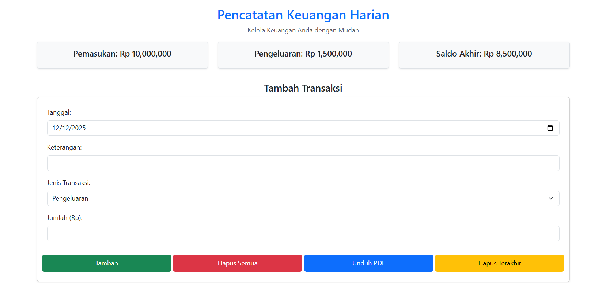
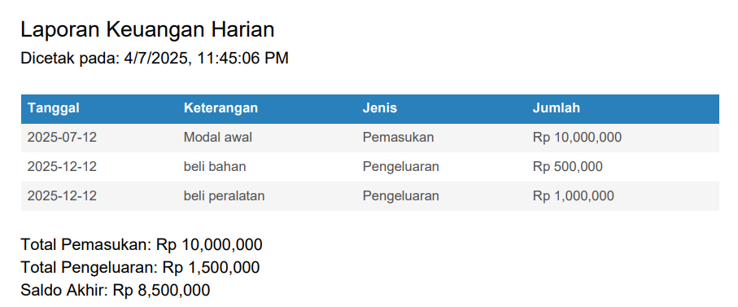

# agnesmonica07.github.io

# Laporan Keuangan Harian

Aplikasi web sederhana berbasis HTML, CSS (Bootstrap), dan JavaScript yang dirancang untuk mencatat serta mengelola keuangan harian secara manual.

## Deskripsi Proyek

Aplikasi ini memudahkan pengguna dalam mencatat transaksi harian, baik pemasukan maupun pengeluaran, menghitung saldo akhir secara otomatis, serta mencetak laporan keuangan dalam format PDF. Aplikasi ini sangat cocok digunakan untuk keperluan pribadi maupun usaha kecil.

## Fitur Utama

- Input data transaksi (tanggal, keterangan, tipe, jumlah)
- Perhitungan otomatis total pemasukan, pengeluaran, dan saldo akhir
- Tombol untuk menghapus semua data atau hanya baris terakhir
- Ekspor laporan keuangan ke format PDF menggunakan jsPDF dan AutoTable

## Instalasi

Tidak memerlukan proses instalasi. Cukup buka file index.html melalui browser.

## Cara Penggunaan

1. Buka file index.html di browser.
2. Isi formulir dengan data transaksi keuangan.
3. Klik tombol _Tambah Transaksi_ untuk menambahkan ke tabel.
4. Gunakan tombol berikut sesuai kebutuhan:
   - _Hapus Semua Data_ untuk menghapus seluruh entri
   - _Cetak PDF_ untuk mengekspor laporan
   - _Hapus Baris Terakhir_ untuk menghapus transaksi terakhir

## Struktur File

- index.html — Berisi struktur halaman, logika JavaScript, serta integrasi dengan Bootstrap dan jsPDF.
- Menggunakan CDN eksternal untuk:
  - Bootstrap 5 (antarmuka pengguna)
  - jsPDF dan jsPDF-AutoTable (fitur ekspor PDF)

## Screenshots

Berikut adalah tampilan antarmuka aplikasi:

### Form Input dan Tabel Transaksi

### Hasil Ekspor PDF

## Kontribusi

Kontribusi terbuka untuk siapa saja. Silakan buat pull request atau buka issue apabila memiliki saran atau menemukan bug.

## Lisensi

Proyek ini bersifat open-source. Bebas digunakan, dimodifikasi, dan dibagikan kembali sesuai kebutuhan.

## Kontak

Untuk pertanyaan atau kerja sama, silakan hubungi:  
_Nama_: Agnes Monica
_Email_: agnesmonica071205@gmail.com

## Riwayat Versi

- _v1.0.0_ (07 April 2025): Rilis awal dengan fitur dasar pencatatan transaksi dan ekspor PDF.
